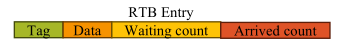
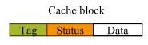
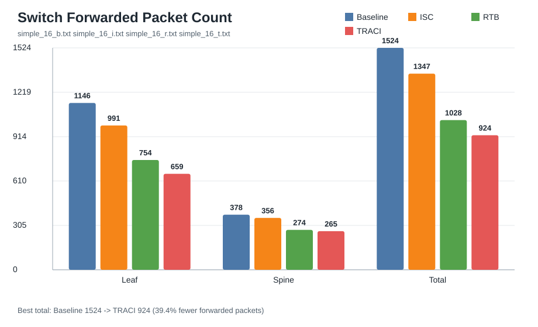
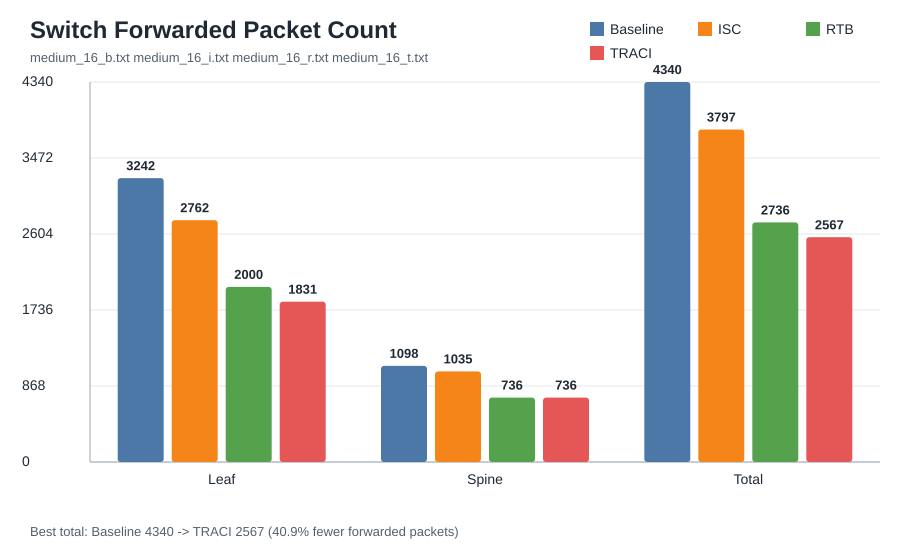
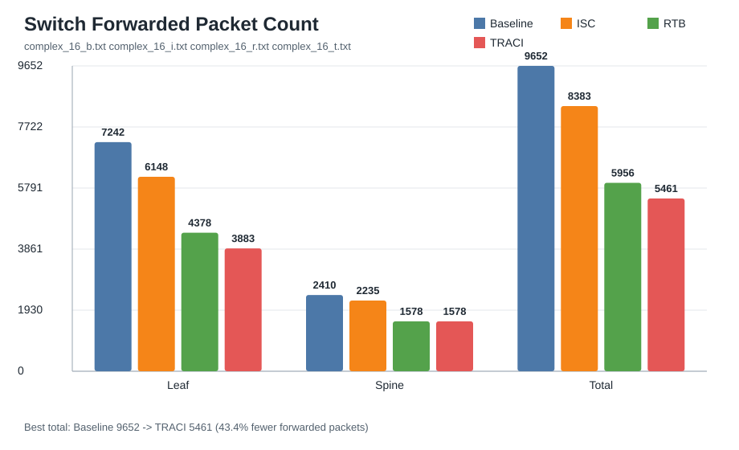

# TRACI 网络模拟器

本项目是论文 [TRACI: Network Acceleration of Input-Dynamic Communication for Large-Scale Deep Learning Recommendation Model](https://dl.acm.org/doi/10.1145/3695053.3731105) 的网络结构模拟器。项目使用 Docker 容器构建一个二层 fat-tree 网络，并用 libpcap 在容器内部捕获和发送自定义 Ethernet packet，模拟 DLRM 训练中 embedding aggregation 的通信行为。

模拟器支持四种运行模式：

- `-b`：Baseline，只按 fat-tree 路由转发请求和回复；
- `-i`：只启用 In-Switch Cache（ISC）；
- `-r`：只启用 Reduction Table（RTB）；
- `-t`：启用完整 TRACI 逻辑，即 ISC + RTB。

## 背景概述

大规模深度学习推荐模型（DLRMs）的 embedding table 通常很大，单个 GPU 难以完整容纳，训练时需要把 embedding table 分布在多个 GPU 上。一次 embedding aggregation 会从多个 GPU 读取若干 embedding entry，并把它们累加到一个输出特征中。

这类通信存在两种复用机会：

- 输入复用：同一个 embedding entry 可能被多个请求重复读取，可以缓存在交换机上，后续命中时由交换机直接生成回复；
- 输出复用：多个输入 entry 会被聚合到同一个输出地址，可以在交换机内提前做 reduction，减少返回路径上的 packet 数量。

TRACI 在交换机中加入 Reduction Table（RTB）和 In-Switch Cache（ISC），并使用 `GetReduce` 原语表达这种新的通信。

## GetReduce

`GetReduce` 的请求和回复格式为：

```text
GetReduce.req(IAddr, OAddr)
GetReduce.resp(OAddr, count, data[, IAddr])
```

字段含义：

- `IAddr`：输入 embedding entry 的全局地址；
- `OAddr`：聚合输出的全局地址；
- `count`：当前 response 已聚合的输入数量；
- `data`：模拟的 embedding 数据。本项目不建模真实向量，使用输入 local address 作为标量数据。

本项目中的 TRACI header 位于 Ethernet header 之后，定义见 `src/common.h`：

```c
typedef struct {
    uint32_t seq_num;
    uint32_t iaddr;
    uint32_t oaddr;
    uint32_t count;
    uint32_t data;
    uint8_t traci_type;
} __attribute__((packed)) traci_header_t;
```

`traci_type = 1` 表示 request，`traci_type = 2` 表示 response。

## RTB

RTB 用于实现输出复用。论文中的 RTB entry 包含 `Tag`、`Data`、`Waiting count`、`Arrived count`。本项目对应实现为：

```c
typedef struct {
    int valid;
    uint32_t tag;
    uint32_t data;
    uint32_t waiting_count;
    uint32_t arrived_count;
    uint32_t seq_num;
} rtb_entry_t;
```



请求经过交换机时，交换机会用 `OAddr` 查询 RTB：

1. 命中已有 entry，则 `waiting_count += 1`；
2. 未命中且有空 entry，则创建新 entry；
3. RTB 满时，如果请求来自 GPU 侧端口，leaf 可以暂存等待；如果请求来自其他交换机，则绕过 RTB，按 Baseline 转发，避免网络死锁。

回复经过交换机时，交换机会再次用 `OAddr` 查询 RTB：

1. 命中 entry，则把 response 的 `data` 加到 entry 中；
2. 按 `count` 减少 `waiting_count`，增加 `arrived_count`；
3. 如果仍有等待项，丢弃当前 response；
4. 如果 `waiting_count == 0`，生成一个聚合 response，并把 `count` 设置为 `arrived_count`。

论文实验配置中，RTB 为 `2 MB`，entry 大小为 `256 B`，共 `8192` 个 entry。本项目在 `src/common.h` 中也使用：

```c
#define RTB_ENTRY_NUM 8192
```

## ISC

ISC 用于实现输入复用。论文中的 ISC cache block 包含 `Tag`、`Status`、`Data`。本项目暂不模拟多 flit 传输，因此只保留 valid/tag/data：

```c
typedef struct {
    int valid;
    uint32_t tag;
    uint32_t data;
} isc_entry_t;
```



ISC 的行为如下：

- response 经过交换机时，如果 `count == 1` 且带有有效 `IAddr`，则把 `IAddr -> data` 插入 ISC；
- request 经过交换机时，如果 `IAddr` 命中 ISC，则交换机直接生成 response，不再继续把 request 发送到后方 GPU；
- 缓存生成 response 后仍会进入当前交换机的 RTB response 处理流程，因此 ISC 和 RTB 可以组合工作。

论文实验配置中，ISC 同样为 `2 MB`，共 `8192` 个 cache lines。本项目使用：

```c
#define ISC_ENTRY_NUM 8192
```

## 网络实现

项目用 Docker 容器模拟 GPU、leaf switch 和 spine switch。容器之间不配置 IP，全部通信运行在 Ethernet 二层。

拓扑由 `script/setup.sh` 创建。例如：

```bash
sudo ./script/setup.sh 16 2 2
```

表示创建 16 个 GPU、2 个 leaf switch、2 个 spine switch，每个 leaf 下挂 8 个 GPU。

### MAC 地址规则

所有自定义 MAC 都使用前缀 `aa:bb:cc`。

| 链路方向 | MAC 格式 | 示例 |
| --- | --- | --- |
| GPU 端口 | `aa:bb:cc:00:00:<gpu_id>` | `gpu3` 为 `aa:bb:cc:00:00:03` |
| Leaf 下行端口 | `aa:bb:cc:01:00:<gpu_id>` | `leaf0-gpu3` 为 `aa:bb:cc:01:00:03` |
| Leaf 上行端口 | `aa:bb:cc:02:<leaf_id>:<spine_id>` | `leaf1-spine0` 为 `aa:bb:cc:02:01:00` |
| Spine 端口 | `aa:bb:cc:03:<spine_id>:<leaf_id>` | `spine0-leaf1` 为 `aa:bb:cc:03:00:01` |

GPU 发出的 packet 目标 MAC 总是输入地址所在 GPU 的 MAC。Leaf 根据目标 GPU 是否在本 leaf 下决定下行转发或上行到 spine。多个 spine 可选时，leaf 使用 `hash_oaddr(OAddr) % SPINE_NUM` 选择 spine。这样可以保证同一个输出聚合地址的 request/response 经过一致路径，满足论文中 RTB 对反向路径一致性的要求。

### 全局地址格式

workload 文件中每行是：

```text
Input_GPU Input_local_addr Output_local_addr
```

GPU 程序会把它转换成 32 位全局地址：

```text
31          24 23                  0
+-------------+---------------------+
|   GPU ID    |     local addr      |
+-------------+---------------------+
```

即：

```c
global_addr = (gpu_id << 24) | (local_addr & 0x00ffffff)
```

因此：

- `IAddr = Input_GPU << 24 | Input_local_addr`
- `OAddr = 当前请求 GPU << 24 | Output_local_addr`

## 项目结构

```text
.
├── Dockerfile
├── Makefile
├── README.md
├── assets/
│   ├── RTB_entry.png
│   ├── ISC_block.png
│   └── *.svg
├── result/
│   └── *.txt
├── script/
│   ├── setup.sh
│   ├── clean.sh
│   ├── test.sh
│   ├── restart.sh
│   ├── logs.sh
│   └── plot_switch_forwarding.py
├── src/
│   ├── common.h
│   ├── common.c
│   ├── gpu.c
│   ├── leaf.c
│   └── spine.c
└── workloads/
    ├── simple_16/
    ├── medium_16/
    └── complex_16/
```

核心文件：

- `src/gpu.c`：读取 workload，发送 GetReduce request，回复其他 GPU 的 request，统计完成条件；
- `src/leaf.c`：leaf switch 转发、RTB、ISC、GPU 侧 stall；
- `src/spine.c`：spine switch 转发、RTB、ISC；
- `src/common.c`：pcap 捕获线程、packet buffer、RTB/ISC 公共逻辑；
- `script/setup.sh`：创建 Docker 拓扑；
- `script/test.sh`：编译容器内程序并启动一次测试；
- `script/restart.sh`：在已有拓扑上切换模式重跑；
- `script/logs.sh`：保存所有容器日志到 `result/`；
- `script/plot_switch_forwarding.py`：统计交换机 `forwarded` 日志并输出 SVG。

## Workload

当前提供 3 组 16-GPU workload：

| Workload | 每 GPU 请求数 | 总请求数 | 说明 |
| --- | ---: | ---: | --- |
| `simple_16` | 24 | 384 | 小规模可行性测试 |
| `medium_16` | 67 | 1072 | 中等规模 DLRM-like workload |
| `complex_16` | 151 | 2416 | 更复杂的 DLRM-like workload |

这些 workload 由大模型构造，按 DLRM embedding bag 的思路构造：每个 GPU 有多个输出 bag，每个 bag 聚合若干输入 embedding entry；输入分布包含热点、中频和长尾 ID，不专门为某一个优化模式构造极端场景。

## 使用方法

脚本需要创建 Docker 容器和 veth 网络，一般需要 root 权限。建议从 `make` 入口运行：

如果本地没有安装 Docker 及 libpcap-dev 等必要的依赖，可以一键安装：

```bash
sudo make setup_env
```

测试给定的 workload：

```bash
sudo make simple_16
sudo make medium_16
sudo make complex_16
```

每个目标会依次执行：

1. 创建 `16 GPUs, 2 Leaf Switches, 2 Spine Switches` 拓扑；
2. 跑 `-b` Baseline；
3. 跑 `-i` ISC；
4. 跑 `-r` RTB；
5. 跑 `-t` TRACI；
6. 保存日志到 `result/`；
7. 绘制对比图到 `assets/`。

测试完成后清理配置：

```bash
sudo make clean
```

也可以手动执行每个脚本，以 `medium_16` workload 为例：

创建拓扑：

```bash
sudo ./script/setup.sh 16 2 2
```

运行某个 workload 的 baseline：

```bash
sudo ./script/test.sh medium_16 -b
```

切换模式继续运行。若不传 workload，`restart.sh` 会沿用上一次 `test.sh` 记录的 workload：

```bash
sudo ./script/restart.sh -i
sudo ./script/restart.sh -r
sudo ./script/restart.sh -t
```

保存日志：

```bash
sudo ./script/logs.sh medium_16_t.txt
```

绘图：

```bash
python3 ./script/plot_switch_forwarding.py \
    result/medium_16_b.txt \
    result/medium_16_i.txt \
    result/medium_16_r.txt \
    result/medium_16_t.txt \
    -o assets/medium_16.svg
```

清理拓扑：

```bash
sudo ./script/clean.sh
```

`setup.sh` 会检查 `.fat_tree_config` 和已有 `gpu/leaf/spine` 容器。如果发现已有拓扑或残留容器，会要求先运行 `clean.sh`。

运行结束后，日志保存在 `result/`。每个日志包含 GPU、leaf、spine 的输出。绘图脚本统计以下形式的交换机转发日志：

```text
Leaf 0: forwarded ...
Spine 1: forwarded ...
```

输出 SVG 保存在 `assets/`，用于对比 Baseline、ISC、RTB 和 TRACI 四种模式下的交换机转发包数量。

## 实现限制

本项目仅基于 Docker 做简单的网络结构模拟，没有实现以下真实情况：

- 不模拟真实 embedding 向量，只用 local address 作为标量 data；
- 不模拟多 flit packet，ISC 的 `Status` 简化为 valid bit；
- 不实现 GPU cache coherence，只假设一次 workload 内数据稳定；
- 不建模真实链路带宽；
- RTB/ISC 的容量按论文的 `8192` entries 设置，但没有考虑面积、功耗和时序等问题；
- 容器内程序的 wall-clock 时间受日志输出、pcap 轮询等模拟器开销影响很大，没有统计延迟和加速比，仅统计了交换机转发数量。

## 常见问题

如果 `setup.sh` 报错已有配置：

```bash
sudo ./script/clean.sh
```

如果上一次 setup 中途失败，可能没有 `.fat_tree_config`，但残留了 `gpu/leaf/spine` 容器。当前 `clean.sh` 会检测并删除这些 stale containers。

如果 `make` 中某个脚本失败，后续命令不会继续执行。修复环境后重新运行对应目标即可。

## 实验结果

本地测试环境：

```
OS: Ubuntu 24.04.4 LTS x86_64
CPU: 13th Gen Intel i5-13500H (16) @ 4.700GHz
Memory: 15714MiB Total
```

三个 Workload 的结果如下：





